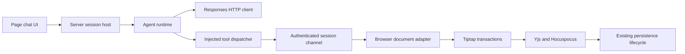

# AI Page Editing Architecture and Implementation Standard

Status: implementation specification and current implementation reference.

Scope: conversational editing of the currently open page in this private,
self-hosted Docmost fork.

This document defines the architecture, behavioral contracts, delivery sequence,
and acceptance criteria for AI page editing. It is the reference for subsequent
implementation decisions. Changes to these contracts must update this document
together with the affected implementation.

## 1. Objective

Provide a conversational editing experience in which an agent reads a page,
invokes focused editing tools, observes their results, and continues until the
requested changes are complete or execution stops. Users see changes in the page
and can continue the conversation to refine them.

The agent runtime must remain independent of Docmost's document model and
application services. Docmost supplies the tools that read and modify its
documents. The runtime orchestrates model calls and tool execution without
accessing the editor, collaboration service, or database directly.

The interaction follows the useful parts of a coding agent: inspect current
content, make targeted changes, handle tool errors, inspect results, and report
the outcome. A filesystem, shell, terminal, code execution sandbox, and
repository discovery are unnecessary for this scope.

## 2. Scope and Product Behavior

### 2.1 Initial release

The initial release supports:

- A chat panel associated with the currently open page.
- Reading the current body and a captured selection as context.
- Replacing text within supported blocks.
- Inserting supported blocks at explicit locations, including into an empty
  page.
- Deleting supported blocks through an explicit operation.
- Multiple tool calls within one user request.
- Streaming assistant messages and displaying completed tool changes.
- Stopping an active run and showing its actual outcome.
- Explicitly undoing supported AI changes without restoring a whole-page
  snapshot.
- Bounded conversation history for the lifetime of the open page session.

Successful edit calls modify the live document immediately. The chat panel
displays a concise change summary and can navigate to the affected block.
Starting a run authorizes its supported edits; there is no mandatory approval
prompt for every tool call.

The page must remain open and the collaboration connection must remain usable.
Navigation, editor destruction, loss of edit access, or disconnection stops the
run. Applied changes remain applied when a run stops.

### 2.2 Deferred capabilities

The following are outside the initial release:

- Editing other pages or searching the workspace.
- Background execution after the page closes.
- Filesystem, shell, browser automation, arbitrary network, or code execution
  tools.
- Multi-agent orchestration, skills, plugin marketplaces, and MCP exposure.
- Retrieval pipelines, embeddings, and workspace knowledge chat.
- Creating attachments or editing diagrams, databases, and embedded content.
- Editing page titles, permissions, comments, or other page metadata.
- Durable chat history, automatic run recovery, and resuming interrupted tool
  execution.
- A separate draft document with an accept/reject merge workflow.
- Billing, model tiers, or commercial administration features.

These capabilities require their own scope decisions. The initial architecture
must not implement speculative infrastructure for them.

## 3. Repository Baseline

The following paths describe the integration points inspected for this
specification:

| Area                      | Existing implementation                                                                                  | Implication                                                                                                                                                 |
| ------------------------- | -------------------------------------------------------------------------------------------------------- | ----------------------------------------------------------------------------------------------------------------------------------------------------------- |
| Live page editor          | [`page-editor.tsx`](../apps/client/src/features/editor/page-editor.tsx)                                  | Tiptap uses Yjs, Hocuspocus, and IndexedDB. Read the active editor rather than a cached page response.                                                      |
| Editor extensions         | [`extensions.ts`](../apps/client/src/features/editor/extensions/extensions.ts)                           | The schema contains rich and application-specific nodes. Unique IDs are configured for headings, paragraphs, and transclusion sources, not every node type. |
| Existing AI menu          | [`ai-menu.tsx`](../apps/client/src/ee/ai/components/editor/ai-menu/ai-menu.tsx)                          | The existing selection-to-Markdown generation flow is a UI reference, not a multi-step editing runtime.                                                     |
| Page content service      | [`page.service.ts`](../apps/server/src/core/page/services/page.service.ts)                               | Content updates already route through the collaboration gateway.                                                                                            |
| Collaboration mutations   | [`collaboration.handler.ts`](../apps/server/src/collaboration/collaboration.handler.ts)                  | Existing replacement deletes and recreates the document fragment. It is not a targeted agent editing primitive.                                             |
| Collaboration persistence | [`persistence.extension.ts`](../apps/server/src/collaboration/extensions/persistence.extension.ts)       | Persistence derives stored JSON, text, and Yjs state from the collaboration document and triggers associated application work.                              |
| Collaboration access      | [`authentication.extension.ts`](../apps/server/src/collaboration/extensions/authentication.extension.ts) | Server-side collaboration authorization remains authoritative.                                                                                              |
| Markdown conversion       | [`markdown/index.ts`](../packages/editor-ext/src/lib/markdown/index.ts)                                  | Existing import/export helpers are reusable only where their supported conversion behavior matches the tool contract.                                       |
| Model dependencies        | [`apps/server/package.json`](../apps/server/package.json)                                                | Page editing uses a small native HTTP client for the OpenAI Responses protocol.                                                                             |

No reusable AI implementation is kept under `apps/server/src/ee`. The current
feature lives under `apps/server/src/integrations/ai-page-editing` so the
runtime, session host, and Responses client remain separate from enterprise
feature modules. Dependency declarations and client routes alone do not
establish a working server-side agent feature.

The implementation must preserve the existing collaboration and persistence
lifecycle. Updating page JSON or text directly in the database would bypass the
active document and is prohibited for agent edits.

## 4. Architecture and Dependency Boundaries



### 4.1 Agent runtime

The runtime owns:

- The bounded model and tool loop through a provider-neutral client.
- The assistant/tool message loop.
- Tool schema registration and dispatch through injected callbacks.
- Streaming text and execution lifecycle events.
- Per-run cancellation, timeouts, and step limits.
- Context assembly from supplied messages and tool results.

It must not import React, Tiptap, Yjs, NestJS application services, page
repositories, or Docmost permission logic. It receives tool definitions, a
dispatcher, model configuration, messages, and cancellation signals through its
public interface.

Runtime dependency types must not become the application's chat storage or wire
protocol. An adapter translates library messages and events into
application-owned contracts.

### 4.2 Session host

The server session host owns authentication, page scope, run lifecycle, API
credentials, and the connection to the owning browser session. It instantiates
the runtime and injects tools bound to that session.

The host validates access before starting a run and before dispatching
mutations. Existing collaboration authorization must also remain enforced.
Browser checks improve correctness and feedback but do not replace server
authorization.

Each session is bound to one user, workspace, page, and editor instance. Model
arguments cannot change those bindings. Only one run may execute within a
session at a time. A new user message during execution is rejected with a clear
busy state in the initial release; the user can stop the run before submitting
another request.

### 4.3 Document adapter

The browser document adapter owns:

- Reading the current editor state.
- Rendering the model-readable buffer projection.
- Mapping handles and text offsets to document positions.
- Validating revisions, supported content, and edit arguments.
- Applying localized editor transactions.
- Tracking changes for UI presentation and supported undo operations.

The adapter is an application editing capability with no dependency on an agent
library. It must be testable through direct calls without a model.

### 4.4 Deployment boundary

The initial runtime runs in the server process behind an independent package
boundary. Logical independence does not imply process fault isolation. A
separate worker or service may be introduced if runtime fault isolation becomes
a concrete requirement; it is not required for the first release.

The separation is successful when:

1. The runtime can operate with an in-memory text adapter without Docmost.
2. The document adapter can execute deterministic test requests without a model.
3. Replacing the runtime library does not change document editing semantics.

## 5. Runtime Selection

The first runtime uses a small native HTTP client for the OpenAI Responses API.
Keeping the protocol client local makes the request and stream behavior
explicit, avoids provider SDK coupling, and keeps the runtime independent from
the page editor. The runtime owns the bounded tool loop and does not expose the
provider's wire types to the application.

Pi agent core is the preferred alternative when a concrete requirement benefits
from its agent lifecycle and event model. Pi's file edit implementation also
provides a useful reference for exact matching and replaceable I/O operations.
The initial implementation must not ship two runtime backends merely to
demonstrate interchangeability.

OpenCode's edit implementation is a reference for tool behavior and error
handling. Importing its full application runtime would introduce unrelated
filesystem, formatting, snapshot, and language-server concerns.

Before adopting a new dependency or copying source, review the selected version,
package surface, and applicable license. External main-branch links are
informative references, not frozen behavioral specifications. This document
defines the behavior required by Docmost.

### 5.1 Responses API configuration

Page editing is configured with three server-only environment variables:

| Variable     | Meaning                                                                                |
| ------------ | -------------------------------------------------------------------------------------- |
| `AI_API_URL` | Provider base URL or complete Responses endpoint, such as `https://api.openai.com/v1`. |
| `AI_API_KEY` | Bearer credential sent only by the server.                                             |
| `AI_MODEL`   | Model identifier accepted by the configured endpoint.                                  |

All three values must be set to enable page editing. The URL is used exactly as
configured when it already ends in `/responses`; otherwise the server resolves
the Responses endpoint before sending a request. The official OpenAI host gets
`/v1/responses` from a root URL, a URL ending in `/v1` gets `/v1/responses`, and
other provider roots get `/responses`. A URL ending in `/chat/completions` is
rewritten to the corresponding `/responses` path. The resolver does not send
probe requests or retry a 404. Requests use `stream: true`, `store: false`, and
include encrypted reasoning content so the stateless tool loop can replay
reasoning items on the next request. The configured service must support
standard Responses streaming and function calling. Chat Completions-only
services are outside the supported contract.

For example, these configurations resolve to the provider endpoints shown:

```env
# Choose one provider base URL:
# OpenAI: https://api.openai.com/v1
# DeepSeek: https://api.deepseek.com
AI_API_URL=https://api.deepseek.com
```

An unavailable or incomplete configuration fails the run with a structured
error. Credentials, authorization headers, and request bodies are never sent to
the browser or written to logs.

Deployments using the previous provider-specific settings must remove
`AI_DRIVER`, `AI_COMPLETION_MODEL`, `AI_CHAT_MODEL`, and provider-specific key
or URL variables, then set `AI_API_URL`, `AI_API_KEY`, and `AI_MODEL` above. The
page-editing integration does not fall back to the removed settings.

## 6. Document Buffer Model

### 6.1 Authority and representation

The authoritative editing state is the current Tiptap document synchronized
through Yjs. A buffer is a session-scoped projection of that document, not an
independent persisted Markdown copy.

Maintain three related representations:

1. The original rich document in the editor.
2. A model-readable projection with explicit block handles and capabilities.
3. A private mapping from handles and projected offsets to current document
   structure.

Do not serialize the whole page to Markdown, modify the string, and replace the
whole page. Import/export conversion is not an established lossless round trip
for IDs, marks, comments, embeds, and application-specific attributes.

### 6.2 Read output

Read results contain a buffer revision and ordered block records. Each record
identifies its handle, node type, capabilities, and supported content. Display
labels and handles are metadata, not editable text.

Example conceptual output:

```text
revision: r17

[block: b1 | type: heading | editable: text]
Deployment

[block: b2 | type: paragraph | editable: text]
Run the application using Docker Compose.

[block: b3 | type: drawio | editable: false]
Architecture diagram
```

Typed tool results must distinguish plain text from Markdown and structural
metadata. For text replacement, `oldText` refers to the block's plain-text
content, not heading syntax or metadata labels.

Protected blocks expose their type and available local description only. The
adapter must not fetch linked pages, embedded resources, or referenced document
contents to enrich this projection.

### 6.3 Handles and revisions

Reuse existing node IDs when suitable, but treat externally exposed handles as
opaque session identifiers. For nodes without IDs, maintain an adapter-owned
mapping. Handles must never silently resolve to a different block after deletion
or structural change.

Use an adapter-local, monotonic document revision. Advance it whenever document
content changes, including remote changes and mark or attribute changes.
Selection-only transactions do not advance it. Include an editor-instance epoch
in the revision identity or invalidate the session when the editor is recreated.

Do not use the page's database `updatedAt` value as this revision. Do not equate
a Yjs state vector with a complete application revision check.

The initial release uses a conservative whole-buffer revision precondition. Any
intervening document change makes a mutation stale, even if it occurred in
another block. This favors predictable behavior over automatic rebasing.
Target-scoped checks may be introduced later with dedicated consistency tests.

### 6.4 Initial content support

| Content                                                                                  | Read behavior                                  | Mutation behavior                                                                             |
| ---------------------------------------------------------------------------------------- | ---------------------------------------------- | --------------------------------------------------------------------------------------------- |
| Ordinary paragraphs and headings                                                         | Text plus relevant structure/format metadata   | Targeted text replacement and explicit supported block deletion                               |
| Simple lists                                                                             | Preserve list hierarchy in the read projection | Text replacement within supported paragraph children; insertion of new validated simple lists |
| Empty document                                                                           | Explicit empty-buffer representation           | Insert supported content at document start                                                    |
| Existing links and formatting marks                                                      | Expose enough context to interpret the text    | Preserve unaffected marks; reject ambiguous replacements                                      |
| Comments and inline atoms                                                                | Indicate protected ranges                      | Reject edits that intersect protected ranges                                                  |
| Tables, code blocks, callouts, columns, transclusions, attachments, diagrams, and embeds | Structural or protected representation         | Preserve existing nodes; do not edit their descendants in the initial release                 |

An otherwise ordinary paragraph inside a protected container remains protected.
Capability checks must inspect ancestry, not just the leaf node type.

New content initially supports paragraphs, headings, and simple bullet or
ordered lists, with a documented subset of basic inline formatting. Unsupported
Markdown constructs must produce an explicit error rather than silently
disappear or degrade. Raw HTML, image insertion, and application-specific nodes
are outside this insertion grammar.

## 7. Tool Contract

Expose a small tool set: `read_buffer`, `edit_buffer`, and `insert_blocks`. No
tool accepts a filesystem path or a model-selected user or workspace identity.
The host binds the buffer to the active page.

The schemas below describe the required semantics. The implementation must
provide concrete runtime schemas and generated or shared TypeScript types for
its wire messages.

### 7.1 `read_buffer`

Inputs select the whole page or explicit block handles, with optional bounded
pagination for long documents. `offset` is zero-based and `limit` is bounded to
100 blocks per call. The result includes:

- Buffer revision and whether the requested view is complete.
- Ordered block records and supported operations.
- Selection context captured when the user submitted the message, if still
  resolvable.
- An explicit `complete` flag and `nextOffset` continuation value when content
  is truncated.

For small pages, inject an initial read result when the run starts. Retain the
read tool for verification, recovery, and large pages. Initial context injection
does not remove the need to read again after conflicts.

Selection context guides the task; subsequent cursor movement must not retarget
an edit. If a captured selection becomes invalid, report that state explicitly.

### 7.2 `edit_buffer`

Inputs contain `expectedRevision` and one or more operations. The initial
operation set is:

- `replace_text`: `blockId`, `oldText`, and `newText`.
- `delete_block`: `blockId`, restricted to deletable supported blocks.

Example:

```json
{
  "expectedRevision": "r17",
  "operations": [
    {
      "type": "replace_text",
      "blockId": "b2",
      "oldText": "Docker Compose",
      "newText": "the provided Docker Compose configuration"
    }
  ]
}
```

Replacement rules:

1. `oldText` is nonempty and matches exactly once in the addressed block.
2. Matching is literal. No fuzzy matching, trimming, case folding, or Unicode
   normalization is performed silently.
3. Empty `newText` deletes the matched text. Removing a whole block requires
   `delete_block`.
4. Every operation is resolved against the same pre-edit document revision.
5. Overlapping edits, ancestor/descendant deletions, and conflicting operations
   are rejected.
6. All operations are validated before any mutation occurs.
7. One successful call applies one local editor transaction and returns its
   resulting revision.

Text replacement is confined to a supported text range within one text block.
Multi-paragraph insertion belongs to `insert_blocks`.

Use localized ProseMirror operations so unaffected nodes, attributes, and marks
remain intact. Replacement text inherits marks only when the matched range has a
uniform supported mark set. Mixed mark boundaries, comment ranges, and inline
atoms produce `UNSUPPORTED_RANGE` in the initial release. The agent may read
again and choose a smaller valid edit; the tool must never silently remove
formatting to succeed.

Block deletion must validate the resulting structure. Unsupported or ambiguous
container cleanup is rejected rather than inferred. Preserve a valid empty
document according to the editor schema when deleting its final supported
content.

### 7.3 `insert_blocks`

Inputs contain `expectedRevision`, a structured insertion target, and Markdown
in the supported insertion grammar.

Insertion targets are `document_start`, `document_end`, `before_block`, or
`after_block`. The latter two require a block handle. Initial insertion is
limited to valid top-level boundaries. An anchor within a nested container is
rejected.

Parse and validate the entire fragment before inserting it. Apply it in one
transaction using the current schema. New nodes receive IDs through the
application's established ID behavior; returned handles must resolve
immediately. Protected existing nodes remain unchanged.

### 7.4 Tool results and errors

Successful mutations return the new revision, a change identifier, affected
block handles, a compact before/after summary, and an application status. The
runtime must receive the actual result before generating the next model step.

Use structured error codes:

| Code                  | Meaning                                              | Expected response                                  |
| --------------------- | ---------------------------------------------------- | -------------------------------------------------- |
| `STALE_REVISION`      | The document changed after the read                  | Read current content and reconsider the edit       |
| `BLOCK_NOT_FOUND`     | The handle no longer resolves                        | Read the relevant document region                  |
| `TEXT_NOT_FOUND`      | The exact source text is absent                      | Read the block; do not guess                       |
| `AMBIGUOUS_MATCH`     | Source text matches more than once                   | Use a longer unique range                          |
| `UNSUPPORTED_RANGE`   | The range crosses protected or unsupported structure | Choose a supported range or explain the limitation |
| `INVALID_CONTENT`     | Inserted content violates the grammar or schema      | Correct the content                                |
| `ACCESS_DENIED`       | The session cannot modify the page                   | Stop the run                                       |
| `SESSION_UNAVAILABLE` | The editor or connection is unavailable              | Stop the run                                       |
| `CANCELLED`           | Execution stopped before application                 | Do not retry automatically                         |
| `RESULT_UNKNOWN`      | A dispatched operation has no confirmed outcome      | Stop and reconcile; do not replay blindly          |

Error details may include bounded relevant context, but must not return
unrelated document content. Every failed validation leaves the document
unchanged.

## 8. Consistency, Undo, and Persistence

### 8.1 Atomicity and concurrency

Serialize mutation calls for each buffer. Read, validate, construct, and
dispatch the transaction against the latest editor state without asynchronous
work between the final revision check and local dispatch.

Parse or perform asynchronous preparation before that final check. Remote
changes received before dispatch must invalidate a stale request. Later remote
updates follow the existing collaboration behavior.

Yjs convergence does not establish semantic freshness. Revision checks protect
against applying instructions derived from obsolete content; Yjs handles
synchronization after the local transaction.

Atomicity applies to one tool call, not the entire agent run. If the third call
fails after two successful calls, the first two remain applied. The UI and final
assistant response must represent that partial outcome.

### 8.2 Undo

The session host associates each browser request with its session, run, and
tool-call identifiers. The document adapter records a change identifier for each
applied transaction and returns it with the affected handles. Provide undo for
the most recent eligible AI change, and allow repeated undo where it remains
safe.

Undo must revert only the recorded AI operation and preserve subsequent
unrelated local or remote edits. Implement this with collaboration-aware history
or mapped inverse operations, and verify its interaction with the existing
editor history. Transaction metadata alone does not establish a correct
selective undo implementation.

If intervening changes overlap the affected range or invalidate the inverse
operation, report a conflict and leave the document unchanged. The initial
release does not promise an unconditional one-click rollback of a whole run.

Undo is an explicit UI action, not a model tool in the initial release. Stop and
undo are separate actions.

### 8.3 Application versus saving

A tool succeeds when its validated transaction has been applied to the active
document. This does not mean that database persistence has completed.

The UI must distinguish applied changes from collaboration connectivity or save
status. Do not invent a durable-save acknowledgement if the existing protocol
does not provide one. Reuse the application's persistence path and preserve its
history, contributor, notification, and reference-update behavior.

## 9. Session Transport and Execution Lifecycle

Use an authenticated bidirectional session channel because the server runtime
must wait for browser-executed tool results. Prefer an existing suitable
transport after checking its authentication and lifecycle behavior. Do not route
agent RPC through undocumented collaboration messages or introduce an external
protocol solely for this feature.

Define application-owned messages for:

- Starting and cancelling a run.
- Assistant text deltas.
- Tool requests and tool results.
- Run completion, failure, and stopping.

Every run-scoped outbound event and tool request carries the owning Socket.IO
session ID and page ID; run events carry a run ID and tool requests carry a
tool-call ID. The host adds a monotonic sequence number to outbound messages
within a run for ordered UI processing. Sequence numbers do not imply durable
event replay. Incoming tool results are bound to the authenticated socket and
the outstanding call rather than trusting a client-supplied identity. The
browser accepts a request only when its page ID matches the active editor
instance.

A tool result is accepted only from the bound browser connection for an
outstanding call, after schema validation. The browser stores a bounded result
record for completed calls during the session. Repeated delivery of the same
call ID returns its recorded result; it must not apply the edit again.

Recommended run states:

```text
idle -> running -> completed
               -> failed
               -> stopping -> stopped
```

Tool requests separately track pending, applied, rejected, cancelled, or unknown
outcomes. Cancellation and timeout must not relabel an already applied edit as
unapplied.

On cancellation:

1. Stop scheduling new model steps and tools.
2. Abort the model request where supported.
3. Cancel tool requests that have not begun applying.
4. Settle or explicitly mark the outcome of any in-flight operation.
5. Display the confirmed changes and any unresolved result.

An editor transaction already dispatched cannot be cancelled. If its
acknowledgement is lost, mark its result unknown. The initial release stops the
run and requires a fresh document read before further work; it does not
automatically resend the mutation after reconnecting.

## 10. Context, Limits, and Model Instructions

The run context contains the user request, bounded prior conversation, current
page projection, selection context, and tools. Page contents are task data and
cannot grant new capabilities or override the tool contract.

The system instructions must explain:

- The current-page scope and live-edit behavior.
- Reading before editing and rereading after stale or missing matches.
- Exact matching and supported block capabilities.
- Using tool results as the source of truth for what changed.
- Avoiding claims that edits were saved or completed without corresponding
  evidence.
- Explaining unsupported edits without repeatedly guessing tool arguments.

Set explicit configuration for model steps, total run duration, individual tool
timeouts, context size, insertion size, and recovery attempts. Use a small
bounded recovery budget for repeated edit errors; do not allow unbounded
guess-and-retry loops.

The current implementation uses eight model steps per run, 24 browser tool
requests including the initial read, a 45-second browser result timeout, a
five-minute run timeout, a 20-message history window with an 80,000-character
aggregate history budget, 20,000-character prompt and block-text limits, a
40,000-character Markdown insertion limit, 100 blocks per read page, an
80,000-character read-result budget, and a 60,000-character initial buffer
context. These limits are implementation defaults and must be changed together
with this document and the corresponding schemas.

Writes execute sequentially regardless of the chosen library's default tool
concurrency. A model-generated batch of dependent writes must either be
represented as one atomic tool call or obtain fresh revision information between
calls.

When trimming history, retain valid assistant/tool-result pairs and never
discard the result of an outstanding tool call. Use fresh reads instead of
repeatedly retaining obsolete whole-page snapshots. Automatic long-term memory
and background summarization are unnecessary for the initial scope.

## 11. User Interface

The page chat panel presents assistant text, tool progress, compact change
summaries, and run controls. It distinguishes ordinary discussion from executed
changes.

Required behavior:

- Capture the page and selection when submitting a message.
- Show read/edit activity without exposing raw protocol payloads by default.
- Apply only complete, validated tool calls; never stream incomplete edits into
  the document.
- Keep the user's editor focus and selection stable where possible.
- Navigate to affected blocks on request rather than stealing focus after every
  edit.
- Show partial completion, conflict, cancellation, and unknown outcomes
  explicitly.
- Provide stop and eligible-change undo actions.
- Explain that changing pages or losing the connection ends the active run.

The UI consumes application-owned events rather than importing runtime-specific
event types. Existing AI menu components may supply reusable presentation
pieces, but the conversational workflow has its own session state.

## 12. Authorization and Data Handling

Provider credentials remain on the server. The browser receives only the session
data and events needed to operate the feature.

The host enforces current-page scope and access for tool dispatch. Existing
collaboration authorization remains authoritative for synchronization. If
inspection reveals an actual access-revocation gap in the supported
collaboration flow, resolve it before enabling agent writes rather than relying
on a frontend `editable` flag.

Validate model arguments, browser result envelopes, inserted content, and
document schema constraints. Unsupported links, HTML, or node construction must
not bypass the application's existing sanitization rules.

Do not include secrets, authentication tokens, provider request bodies, or full
document contents in operational logs. Document text is sent only as required by
the configured model invocation and explicit tool results.

## 13. Observability

Use the feature prefix `[ai_page_editing]` for relevant runtime, host, bridge,
and adapter diagnostic entries. Include identifiers, tool names, timings,
revisions, result codes, and operation counts where useful. Do not log raw
prompts, replacement text, or credentials.

Provide integration scenarios under the server's AI page-editing test area. The
session test uses a deterministic Responses client substitute, while the HTTP
client test feeds chunked SSE events. Together they exercise the runtime
wrapper, session host, browser tool bridge, request shape, streaming parser,
reasoning-item preservation, read, edit, result feedback, and completion.

Once that scenario exists, the following command executes the feature flow and
writes focused diagnostics:

```bash
pnpm --filter server exec jest --runInBand --testPathPatterns=integrations/ai-page-editing 2>&1 | rg --line-buffered '\[ai_page_editing\]' > ai-page-editing.debug.log
```

The scenario emits meaningful prefixed diagnostics. For pass/fail verification,
also run the test directly: the log-filtering pipeline is intended for diagnosis
and does not reliably report the test runner's exit status in every shell.

## 14. Code Organization

The following paths describe the responsibility boundaries. The current first
release implementation occupies the server integration and client feature paths
shown below; future extraction into a standalone package may preserve the same
contracts:

```text
apps/server/src/integrations/ai-page-editing/
  contracts.ts
  agent-runtime.ts
  model.ts
  responses-client.ts
  ai-page-editing.service.ts
  agent-runtime.spec.ts
  ai-page-editing.integration.spec.ts
  responses-client.spec.ts

apps/client/src/features/ai-page-editing/
  ai-page-editing-panel.tsx
  ai-page-editing-panel.module.css
  document-buffer.ts
  document-buffer-types.ts
  document-buffer-utils.ts
  document-buffer.test.ts
```

`agent-runtime.ts` must not depend on page repositories, editors, collaboration
services, or application authorization. The host supplies document tools through
generic runtime interfaces. The protocol types are transport-neutral and the
client imports no server runtime code.

Keep parsing, position mapping, mutation validation, and history
responsibilities separable. Follow repository formatting and file-size rules.
Create only the modules needed for the current delivery stage.

The automated coverage currently exercises the deterministic buffer, the
Responses HTTP/SSE client, and a server-side read/edit loop with a deterministic
client. Collaborative persistence, endpoint smoke checks, and multi-browser
behavior remain release verification work because they require a running
application and external services.

## 15. Implementation Sequence

### Stage 1: Deterministic document adapter

Implement projection, handles, revisions, supported-node detection, read,
replacement, insertion, deletion, and safe undo behavior. Invoke these
capabilities without an LLM.

Exit criteria: rich-document preservation, revision rejection, atomic
validation, and undo-conflict tests pass. No model integration is needed to
prove these properties.

### Stage 2: Runtime and session contracts

Implement the provider-independent Responses runtime, native HTTP/SSE client,
application events, scoped session host, authenticated tool bridge, call
deduplication, cancellation, and limits. Use a deterministic client substitute
to exercise the full loop.

Exit criteria: successful multi-step execution, error recovery, cancellation
races, and connection-loss behavior are verified without external model
credentials.

### Stage 3: Current-page chat

Connect the runtime to the browser adapter and add the page chat UI, selection
capture, tool summaries, stop control, and undo actions. Add the configured
Responses endpoint integration with server-held credentials.

Exit criteria: the supported user scenarios work in a real collaborative page,
including a second browser editing concurrently.

### Stage 4: Release verification

Verify schema preservation, access boundaries, content limits, cleanup,
diagnostics, and persistence through the existing collaboration path. Document
the exact supported insertion grammar and operational configuration alongside
the implementation.

Exit criteria: all release acceptance criteria below pass. Do not expand into
background agents or workspace tools before these requirements are met.

## 16. Validation and Acceptance Criteria

Tests must exercise observable behavior and data preservation rather than
reproduce implementation details. Use existing client and server test runners.
Real-model tests are optional smoke checks and must not be the only correctness
evidence.

| Scenario                                                          | Required outcome                                                                                  |
| ----------------------------------------------------------------- | ------------------------------------------------------------------------------------------------- |
| Rewrite one paragraph                                             | Only the intended range changes; surrounding structure and IDs remain intact                      |
| Repeated source text                                              | An ambiguous replacement fails without mutation                                                   |
| Multiple disjoint replacements                                    | All apply against the original revision in one transaction                                        |
| One invalid operation in a batch                                  | Nothing in the batch applies                                                                      |
| User types after the agent reads                                  | The pending edit fails its revision precondition                                                  |
| Remote user edits after the read                                  | The pending edit fails its revision precondition when that update is present locally              |
| Remote edit after local application                               | Existing collaboration convergence is preserved; no claim of semantic conflict resolution is made |
| Existing marks and links                                          | Unaffected marks remain; ambiguous mixed-mark replacements are rejected                           |
| Protected ancestor or inline atom                                 | The tool rejects the range without flattening it                                                  |
| Diagram, table, attachment, or transclusion elsewhere on the page | The original protected node JSON remains unchanged                                                |
| Empty page insertion                                              | A valid supported document fragment is created                                                    |
| Unsupported insertion syntax                                      | An explicit error occurs with no partial insertion                                                |
| Supported block deletion                                          | Remaining structure is valid; unrelated nodes remain unchanged                                    |
| Duplicate tool request                                            | The operation executes once and returns the recorded result                                       |
| Stop before dispatch                                              | No new edit is applied                                                                            |
| Stop after application                                            | The applied change remains accurately reported                                                    |
| Lost acknowledgement                                              | The result becomes unknown and is not automatically replayed                                      |
| Navigation or disconnect                                          | The run stops and later responses cannot target another editor                                    |
| Access denial                                                     | The mutation is not dispatched or accepted through an unauthorized path                           |
| Undo after an unrelated edit                                      | Only the eligible AI change is reverted                                                           |
| Undo after an overlapping edit                                    | A conflict is shown and neither edit is silently overwritten                                      |
| Long page                                                         | Truncation is explicit and remaining blocks can be read within limits                             |
| Model repeatedly submits invalid edits                            | Recovery stops at the configured bound                                                            |
| Reload after confirmed persistence                                | The edited content is retained through the existing save path                                     |
| Runtime replacement test                                          | A fake generic runtime can use the same document tool dispatcher                                  |
| Runtime independence test                                         | The runtime completes a read/edit loop against an in-memory text tool                             |

Before release, manually verify a page containing headings, lists, links,
comments, images, tables, diagrams, and references. Change only ordinary
supported text and compare the untouched rich-document subtrees. Also verify
that ordinary keyboard undo behavior remains usable after AI edits.

## 17. Future Extensions

A server-side document adapter can later support background editing through the
collaboration service. It must provide equivalent tool semantics, authorization,
revisions, localized mutations, and result handling; invoking the current
whole-document replacement handler is insufficient.

A draft workflow can later separate proposed edits from live edits. Applying a
draft requires validating its base and committing localized changes to the
current document. A draft generated from an old snapshot must never overwrite a
newer whole page.

Workspace search and multi-page editing require explicit tools with
independently enforced scope. They do not require giving the runtime direct
database access.

Target-scoped revision checks, richer formatting edits, table operations, and
persistent sessions should be added only with corresponding tool contracts,
consistency rules, and acceptance tests.

## 18. References

- [Responses API function calling](https://developers.openai.com/api/docs/guides/function-calling):
  function definitions, call arguments, and tool outputs.
- [Responses API streaming](https://developers.openai.com/api/docs/guides/streaming-responses):
  streamed text and function-call event handling.
- [Responses API migration guide](https://developers.openai.com/api/docs/guides/migrate-to-responses):
  replaying output and encrypted reasoning items with `store: false`.
- [Pi agent core](https://github.com/earendil-works/pi/tree/main/packages/agent):
  independent agent execution and event streaming.
- [Pi edit tool](https://github.com/earendil-works/pi/blob/main/packages/coding-agent/src/core/tools/edit.ts):
  targeted replacements and injectable editing operations.
- [OpenCode edit tool](https://github.com/anomalyco/opencode/blob/dev/packages/opencode/src/tool/edit.ts):
  reference implementation of text replacement and surrounding coding-tool
  integration.
